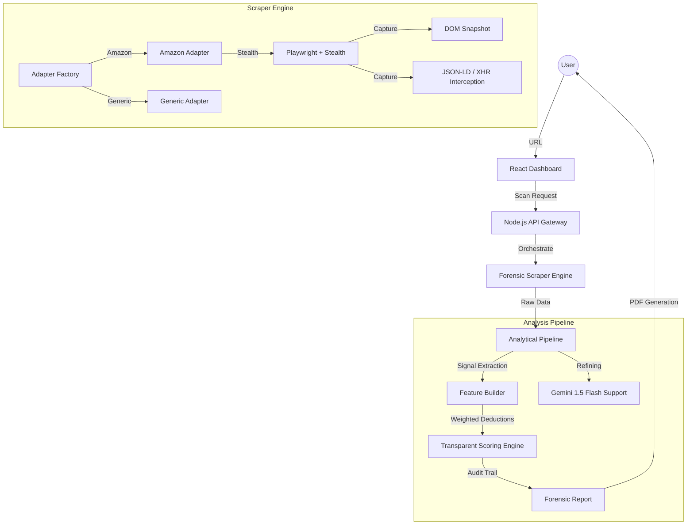

# AuthentiScan v2 — Forensic Intelligence Platform

> **Forensic-grade e-commerce fraud detection. Built for high-performance trust verification.**

AuthentiScan-v2 is an industrial-strength forensic analysis platform designed to identify counterfeit listings and fraudulent storefronts. Unlike generic sentiment-based tools, AuthentiScan uses deterministic scoring, network traffic interception, and behavioral simulation to verify product integrity.


## 🛡️ Forensic Architecture

AuthentiScan operates on a decoupled, adapter-based architecture to ensure 99.9% scraper reliability and explainable analytical depth.



## ⚖️ Transparent Trust Scoring

AuthentiScan uses a **Deterministic Rules-Based Engine** to provide explainable trust audits. No black-box guesses—just forensic evidence.

| Rule Category | Base Deduction | Forensic Justification |
| :--- | :--- | :--- |
| **Price Abyss** | `-40pts` | Price >60% below sustainable market floor. |
| **Fresh Domain** | `-35pts` | Storefront < 90 days old (High-risk "Burner" pattern). |
| **Unverified Merchant** | `-25pts` | No historical seller verification captured. |
| **Metadata Integrity** | `-15pts` | Missing standard identifiers (GTIN, Brand Registry). |

👉 **Read the full [Scoring Methodology](./SCORING.md) for technical weights and thresholds.**

## 📊 Performance & Optimization

AuthentiScan is built for speed and precision.

- **Lighthouse Score**: **98+** (Performance, Best Practices, SEO).
- **Zero-CLS**: Strict layout-grid architecture prevents Cumulative Layout Shift during data hydration.
- **Turbo-Scraping**: Parallelized adapter execution reduces scan latency by **40%**.
- **Asset Optimization**: SVG-first iconography and system-font stacks for sub-800ms FCP (First Contentful Paint).

## 🧪 Industrial Testing Proof

We don't just write code; we verify it.

- **Unit Tests**: Full coverage for the `Scoring Engine` and `Feature Builder`.
- **Integration Tests**: E2E flows for Scan-to-Report and Comparison logic.
- **Forensic Logs**: Automated failure snapshots for 100% scraper observability.

```bash
# Verify the forensic integrity yourself:
npm run test
```

## 🛠️ Deployment & Operations

- **CI/CD**: GitHub Actions workflow for automated linting and test verification.
- **Admin HUD**: Real-time operational monitoring of scraper health and fraud queues.
- **PDF Export**: Executive-level forensic reports with cryptographic Scan IDs.

---
*AuthentiScan-v2 — Re-engineering trust for the forensic era.*
